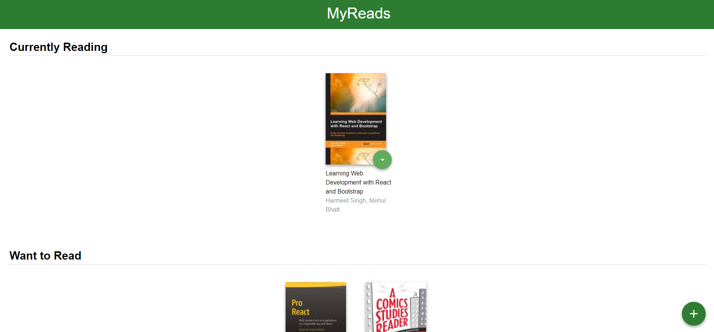
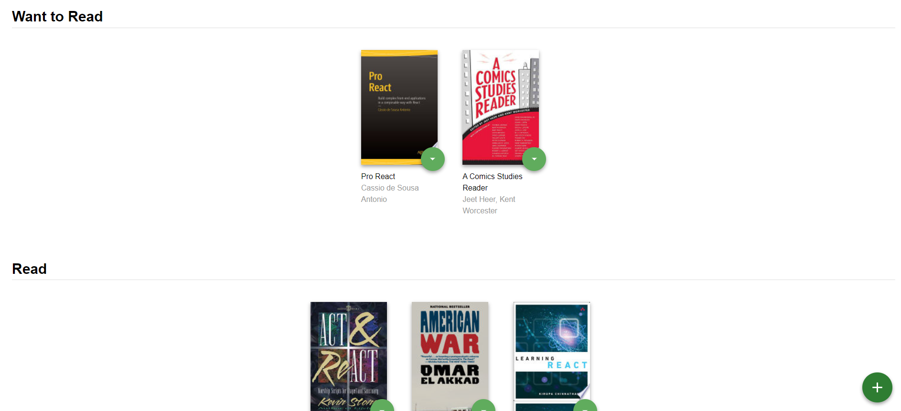
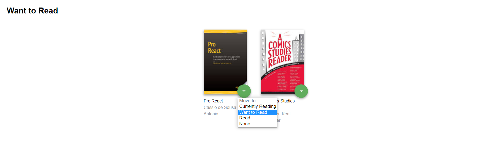
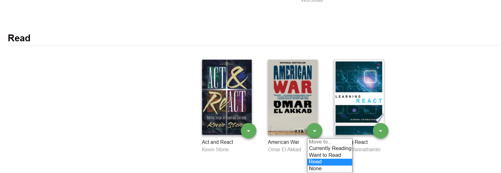
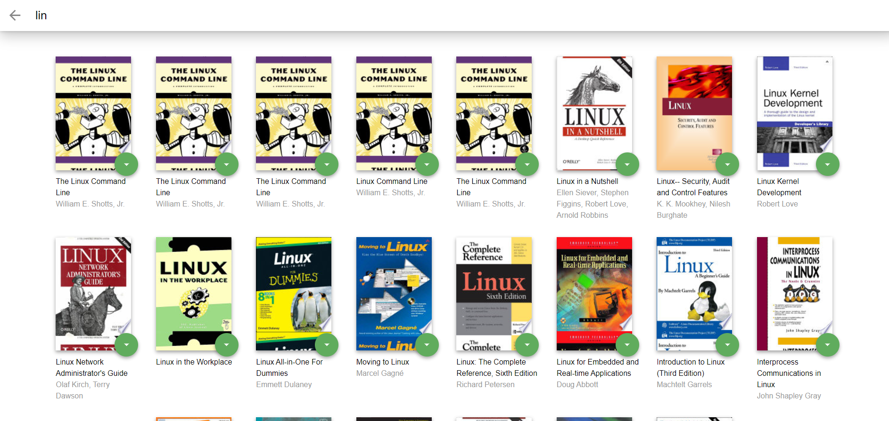
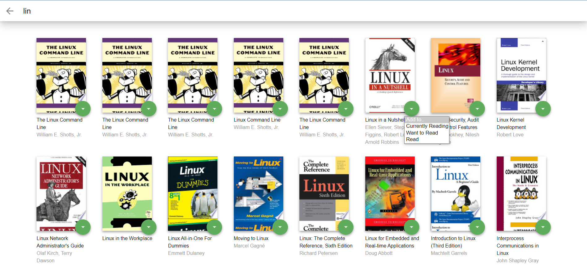
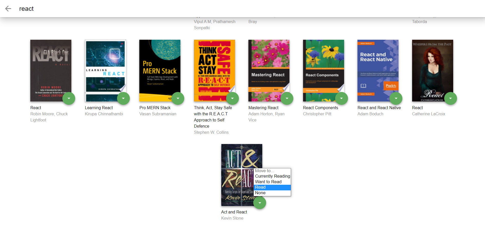
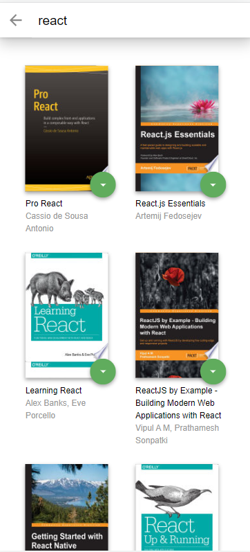
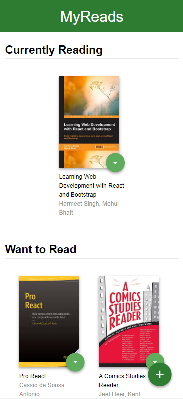
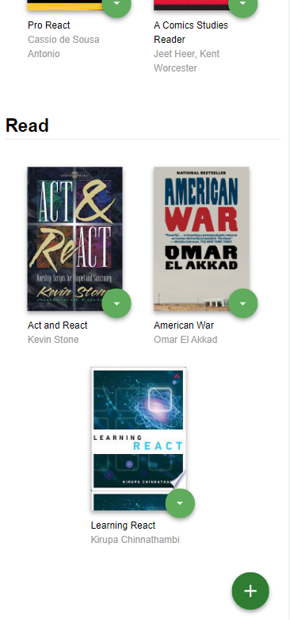

<div align="center">

[](https://github.com/ZeyadTarekk/My-Reads/contributors)
[](https://github.com/ZeyadTarekk/My-Reads/issues)
[](https://github.com/ZeyadTarekk/My-Reads/blob/master/LICENSE)
[](https://github.com/ZeyadTarekk/My-Reads/network)
[](https://github.com/ZeyadTarekk/My-Reads/stargazers)
[](https://img.shields.io/github/languages/count/ZeyadTarekk/My-Reads)

</div>

## 📝 Table of Contents

- [About](#about)
- [Get started](#get-started)
  - [Installation](#Install)
  - [Running](#running)
- [Technology](#tech)
- [Screenshots](#Screenshots)
- [Contributors](#Contributors)
- [License](#license)

## 📙 About <a name = "about"></a>

- The main page shows three shelves for books.
- Each book is shown on the correct shelf, along with its title and all of its authors.
- Each bookshelf is a reusable component.
- The main page shows a control that allows users to move books between shelves.
- When the browser is refreshed, the same information is displayed on the page.
- As the user types into the search field, books that match the query are displayed on the page, along with their titles and authors.
- Search results are not shown when all of the text is deleted out of the search input box.
- Invalid queries are handled and prior search results are not shown.
- If a book is assigned to a shelf on the main page and that book also appears on the search page, the correct shelf should be selected for that book on the search page.
- When an item is categorized on the search page and the user navigates to the main page, it appears on that shelf in the main page.
- Using some react hooks to do different things

## 🏁 Getting Started <a name = "get-started"></a>

> This is an list of needed instructions to set up your project locally, to get a local copy up and running follow these
> instructuins.

### Installation <a name = "Install"></a>

1. **_Clone the repository_**

```sh
$ git clone https://github.com/ZeyadTarekk/My-Reads.git
```

2. **_Navigate to repository directory_**

```sh
$ cd My-Reads
```

3. **_Install dependencies_**

```sh
npm install
```

### Running <a name = "running"></a>

1. **_Running on development mode_**

```sh
npm start
```

Open http://localhost:3000 with your browser to see the result

2. **_Compiling for production mode_**

```sh
npm run build
```

## 💻 Built Using <a name = "tech"></a>

- **React.js**
- **Backend RESTful API**

## 📷 Demo Screenshots <a name = "Screenshots"></a>

<div align="center">
<h3 align='left'>Home Page</h3>
   
   <hr>
   
   <hr>
<h3 align='left'>Showing the correct shelf  on Home Page</h3>
   </a>
   <hr>
   </a>
<hr>
<h3 align='left'>Search Page</h3>
</a>
<hr>
<h3 align='left'>Showing the correct shelf  on Search Page</h3>
</a>
<hr>
</a>
<hr>
<h3 align='left'>Responsive Design</h3>
</a>
<hr>
</a>
<hr>
</a>
<hr>
</div>

## Contributors <a name = "Contributors"></a>

<table>
  <tr>
    <td align="center">
    <a href="https://github.com/ZeyadTarekk" target="_black">
    
    <br />
    <sub><b>Zeyad Tarek</b></sub></a>

  </tr>
 </table>

## License <a name = "license"></a>

> This software is licensed under MIT License, See [License](https://github.com/ZeyadTarekk/My-Reads/blob/main/LICENSE) for more information.
